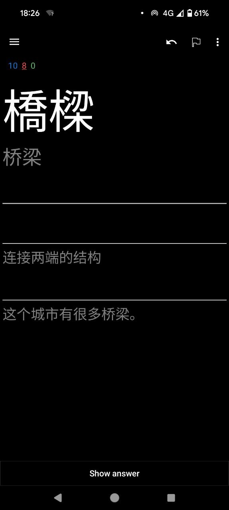
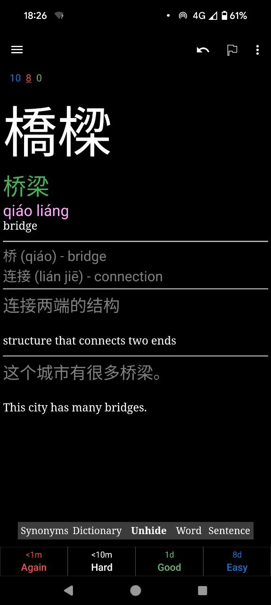
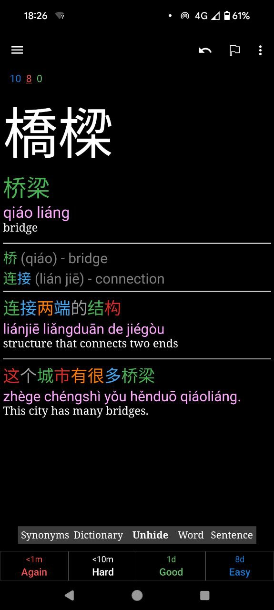
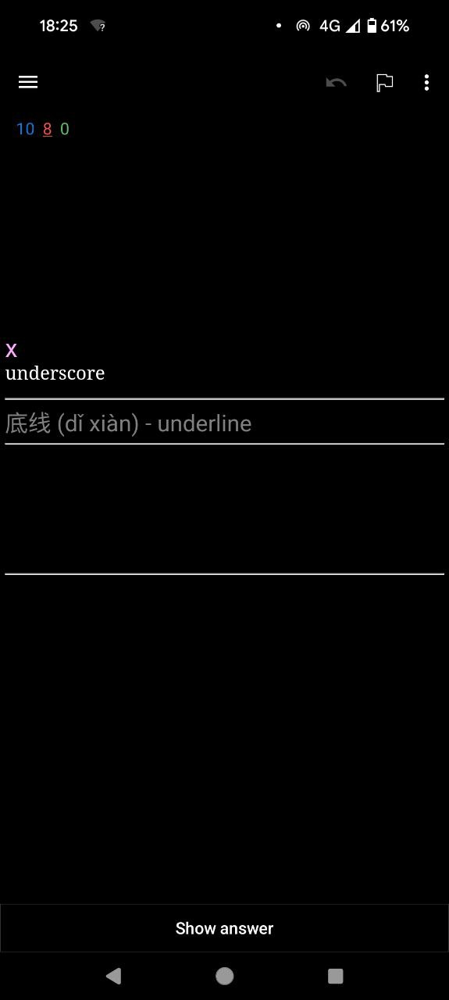
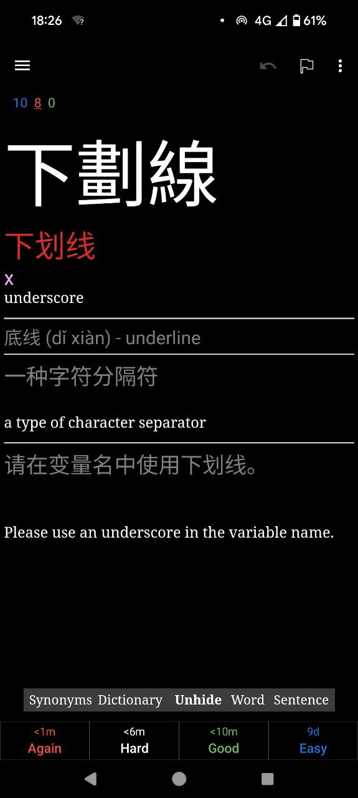
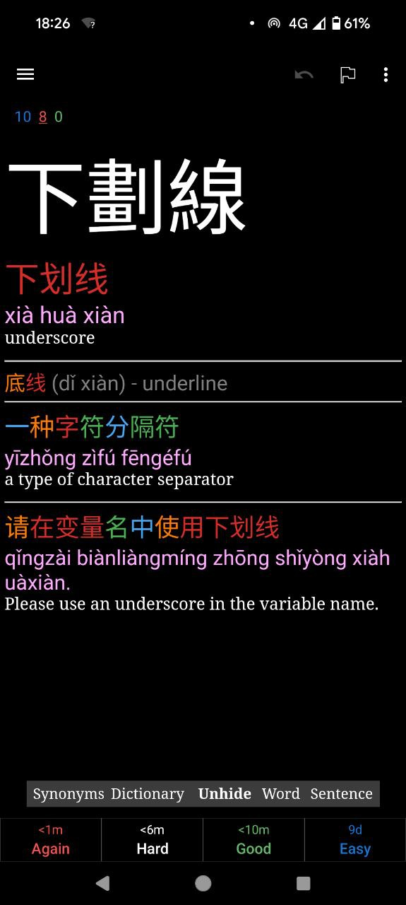

# Chinese Card Generator

The **Chinese Card Generator** is a Python package designed to streamline the process of creating **Anki flashcards** for learning Chinese. It combines LLM-generated content with customized Python processing to turn lists of Chinese words into formatted Anki cards, making it easier to review and learn new Chinese vocabulary.

This package assists in:
1. Requesting an LLM to generate related content, including example sentences, synonyms, and dictionary definitions, for a list of Chinese words.
2. Processing the generated content using Python scripts to format it into Anki-compatible flashcards.
3. Adding helpful tone markings on Chinese characters and generating fields such as **pinyin**, **translations**, **example sentences**, and **synonyms** to enhance language learning.

## Examples

### From English to Chinese:
<div style="display: flex; justify-content: center; gap: 20px; flex-wrap: wrap;">
  
  
  
</div>

### From Chinese to English:
<div style="display: flex; justify-content: center; gap: 20px; flex-wrap: wrap;">
  
  
  
</div>

## Card details

The card features five buttons that offer useful tools to enrich your learning experience by providing access to additional resources and controls:

1. **Synonyms**:  
   This button links to Pleco, where it performs a search for synonyms of the main word on the card. It helps you expand your vocabulary by presenting related words with similar meanings.

2. **Dictionary**:  
   Clicking this button opens Pleco to display the dictionary definition of the main word. It provides detailed information such as meanings, examples, and related terms.

3. **Unhide**:  
   The "Unhide" button reveals or hides specific hidden elements on the card, such as pinyin and color-coded examples for both the dictionary and sentence sections. It allows you to challenge yourself by trying to pronounce the word or sentence tones before revealing the correct pinyin.

4. **Word**:  
   This button searches for the word itself in Pleco, providing detailed information about its usage, pronunciation, and meaning, including its appearance in different dictionary contexts.

5. **Sentence**:  
   This button links to Pleco, showing a search result for the example sentence on the card. It gives further context for the word by illustrating how it's used in real sentences.

These buttons seamlessly integrate with the Pleco dictionary app, giving you quick access to detailed explanations, synonyms, and contextual examples to support your Chinese learning journey.

## Workflow

1. **Install Anki**:
   - Download and install the Anki application, available for **Windows**, **macOS**, **Android**, and **iOS** platforms. Visit the [official Anki website](https://apps.ankiweb.net/) to download the version for your device.
   - After installation, consider creating an account to sync your decks across devices.
   - If you are on Android or iOS, you can install `Pleco` in order to leverage the [buttons](#examples) I created to lookup more in detail the characters.

2. **Import Deck**:
   - To get started, import the `deck.apkg` file into your Anki library:
     - In Anki, go to `File > Import` and select the `deck.apkg` file.
     - The deck will be added to your Anki collection, ready for use.

3. **Prepare the List of Words**:
   - Create a text file containing a list of Chinese words you want to study. This file will serve as input for generating detailed flashcard content using a large language model. I personally use the [Zhongwen Browser Extension](#additional-tools) to gather the vocabulary.
   - Example of the format for the word list:
     ```plaintext
     向量 vector
     矩阵 matrix
     ...
     ```

4. **LLM Query**:
   - Use the following prompt with an LLM to generate the necessary content for each word in your list. You can do that by copying the following prompt, append the word list at the end, and send it manually in an LLM conversation such as on [ChatGPT](https://chatgpt.com/?model=gpt-4o).

   ~~~plaintext
   ### Prompt:
   
   Please create a tab-separated table for the given list of Chinese words. Each entry should include the following columns:
   
      1. **Simplified Characters**: The simplified version of the Chinese characters.
      2. **Traditional Characters**: The traditional version of the Chinese characters.
      3. **Pinyin**: The pinyin transcription of the Chinese word, with **one space** between each syllable and **two spaces** between different words (e.g., 'quán qiú  dìng wèi  xì tǒng' for '全球定位系统').
      4. **Meaning**: The English meaning or translation of the word.
      5. **Sentence Example**: A simple example sentence using the word in Chinese.
      6. **Sentence Meaning**: The English translation of the example sentence.
      7. **Pinyin for Sentence**: The pinyin transcription of the example sentence, with **one space** between each syllable and **two spaces** between different words.
      8. **Synonym**: Up to three synonyms for the word, formatted as "SimplifiedCharacters (Pinyin) - Translation", separated by `<br>`.
      9. **DictionarySimplified**: A short definition of the word in Chinese characters, giving a brief explanation of the term's meaning.
      10. **DictionaryPinyin**: The pinyin transcription of the definition, with **one space** between each syllable and **two spaces** between different words.
      11. **DictionaryMeaning**: The English translation of the definition, giving a brief explanation of the term's meaning.
   
   Use the above structure to create the table for each entry from the provided list of words.
   
   ---
   
   ### Example Input
   
      - 向量 (vector)
      - 矩阵 (matrix)
      - ...
   
   ---
   
   ### Example Output
   
   ```
   Simplified Characters	Traditional Characters	Pinyin	Meaning	Sentence Example	Sentence Meaning	Pinyin for Sentence	Synonym	DictionarySimplified	DictionaryPinyin	DictionaryMeaning
   向量	向量	xiàng liàng	vector	我们需要计算这个向量的长度。	We need to calculate the length of this vector.	wǒ men  xū yào  jì suàn  zhè ge  xiàng liàng  de  cháng dù.	矢量 (shǐ liàng) - vector<br>量向 (liàng xiàng) - vector	数学中用于表示方向和大小的对象	shù xué zhōng  yòng yú  biǎo shì  fāng xiàng  hé  dà xiǎo  de  duì xiàng	object used in mathematics to represent direction and magnitude
   矩阵	矩陣	jǔ zhèn	matrix	这个矩阵的行列式为零。	The determinant of this matrix is zero.	zhè ge  jǔ zhèn  de  háng liè shì  wèi líng.	方阵 (fāng zhèn) - square matrix	由数或变量排列成的矩形阵列	yóu shù  huò  biàn liàng  pái liè chéng  de  jù xíng  zhèn liè	rectangle array formed by numbers or variables
   ```
   
   ---
      
   ### Tips for Generating the Table:
   
      1. **Ensure Pinyin Formatting**: Check that there is **one space** between syllables and **two spaces** between separate words in pinyin.
      2. **Short but Descriptive Definitions**: The `DictionarySimplified`, `DictionaryPinyin`, and `DictionaryMeaning` columns should provide a concise but informative definition of the term.
      3. **Use Simple Example Sentences**: The example sentences should clearly demonstrate the usage of the word in context.
      4. **Multiple Synonyms**: Include up to three synonyms, formatted with `<br>` tags to ensure clarity.
      5. **Accuracy**: Make sure traditional and simplified characters are accurately paired, and translations and meanings reflect the specific terms.
   
   ### Word List

   <<WORD LIST HERE>>
   ~~~

   This will generate a table with all necessary fields for the flashcards.
   [Here](https://chatgpt.com/share/6513c81e-73af-476b-b6d8-cffaeb83652f) is an example of conversation to get the word list. Also [`./data/input.tsv`](./data/input.tsv) is an example of word list generated.

5. **Data Processing**:
   - Once you receive the generated data from the LLM, save it as a `.tsv` file and process it with the `zhongwen-anki` package:
     ```bash
     zhongwen-anki -i 'input_file_path' -o 'output_file_path'
     ```
   - Replace `input_file_path` with the path to your input `.tsv` file and `output_file_path` with your desired output path for the processed data.

6. **Import Processed Data into Anki**:
   - Import the processed `.tsv` file into Anki by selecting `File > Import` and choosing the file. Make sure the fields are correctly mapped before importing.

7. **Start Learning**:
   - Begin reviewing your new flashcards. Adjust your Anki settings for optimal learning based on your preferences (see recommendations below).


## Anki Settings

Since learning vocabulary can take time, it’s important to optimize your Anki settings for effective review sessions. 

<details>
 
<summary>Here is my deck setting (it is tailored made and should be tuned at your liking)</summary>
 
```
 # Daily Limits
 New cards/day = 5
 Maximum reviews/day = 100
 
 # New Cards
 Learning steps = 1m 10m 1d 6d
 Graduating interval = 7
 Easy interval = 10
 Insertion order = Random
 
 # Lapses
 Relearning steps = 10m 20m
 Minimum interval = 2
 Leech threshold = 5
 Leech action = Tag Only
 
 # Advanced
 Maximum interval = 365
 Starting ease = 2.50
 Easy bonus = 1.30
 Interval modifier = 1.10
 Hard interval = 1.20
 New interval = 0.80
```
 
</details>

You can further adjust these settings based on your progress and preferences. For more in-depth guidance on customizing Anki, check out these resources:
- [Guide to Anki Intervals and Learning Steps](https://youtu.be/1XaJjbCSXT0)
- [Other Anki Tutorials](https://www.youtube.com/results?search_query=anki+guide)

## Anki Add-ons

Here are some recommended Anki add-ons to enhance your learning experience:

- **[Auto Ease Factor](https://ankiweb.net/shared/info/1672712021)** or **[Reset Ease](https://ankiweb.net/shared/info/947935257)**: These add-ons help prevent you from falling into [Ease Hell](https://www.youtube.com/watch?v=roR8S9zjUh8), where cards become harder to review due to the scheduling algorithm.
- **[Review Heatmap](https://ankiweb.net/shared/info/1771074083)**: Visualize your past and future review activity with this helpful heatmap, which can motivate you to stay consistent.

You can find additional add-ons on the [Anki add-ons page](https://ankiweb.net/shared/addons/2.1).

## Additional Tools

[Zhongwen Browser Extension](https://github.com/cschiller/zhongwen) is a Chinese pop-up dictionary available for browsers like Chrome and Firefox. It’s an excellent tool for quickly translating Chinese words by hovering over them with your mouse.

- **Quick Vocabulary Addition**: Press `R` while hovering over a word to instantly add it to your vocabulary list.
- **Access Your List**: Use `Alt + W` to view the vocabulary list you've built.

This tool is especially useful for quickly identifying and understanding new Chinese words as you browse the web. Additionally, it’s great for **easily creating a list of words** that can be used in the tool you’re setting up. By building a personalized vocabulary list as you encounter new words, you can seamlessly integrate these words into the flashcard generation process, making it easier to create your own Anki deck.

## Notes

- **Card Themes**: Although the cards should function in various themes (light, plain, dark), they are specifically optimized for the **black theme** in Anki. Consider switching to the black theme for the best experience.
- **Anki Scheduling**: Anki's scheduling system is crucial to effective learning. Be sure to explore and customize the intervals, learning steps, and other settings to match your personal learning style. This can significantly improve retention and reduce burnout.
  - Customize the number of new cards per day and review limits based on your time commitment and learning capacity.
  - Regularly assess your progress and adjust settings like ease and intervals to optimize long-term retention.
- **Deck Backup**: Always back up your Anki decks regularly to prevent data loss. Use Anki’s sync feature with AnkiWeb, or manually export `.apkg` files.

## Data Fields for Review

When you create your Anki cards using this package, the following fields will be included on each card for effective review:

1. **Simplified Characters**: The modern simplified version of the Chinese word.
2. **Traditional Characters**: The classical traditional form of the word.
3. **Pinyin**: The pronunciation guide with correct tone markings.
4. **Meaning**: The English translation of the word.
5. **Example Sentence**: A simple sentence that demonstrates how the word is used in context, with pinyin and translation.
6. **Synonyms**: Up to three related words or expressions with pinyin and English translations.
7. **Dictionary Entry**:
   - **DictionarySimplified**: A short definition of the word in Chinese.
   - **DictionaryPinyin**: Pinyin transcription of the Chinese definition.
   - **DictionaryMeaning**: The English translation of the definition.
8. **Hint**: The first character of the word to help with recall during reviews.


## Installation

Install the package from the repository:

```bash
pip install git+https://github.com/thomashirtz/zhongwen-anki#egg=zhongwen-anki
```

## Buy me a coffee ツ

If this repository helped you or you if you like this project, feel free to support me!  

<a href="https://www.paypal.com/donate/?hosted_button_id=2KQR9V6PRSBPC">
  
</a>

## License

```
Copyright 2021 Thomas Hirtz

Licensed under the Apache License, Version 2.0 (the "License");
you may not use this file except in compliance with the License.
You may obtain a copy of the License at

    http://www.apache.org/licenses/LICENSE-2.0

Unless required by applicable law or agreed to in writing, software
distributed under the License is distributed on an "AS IS" BASIS,
WITHOUT WARRANTIES OR CONDITIONS OF ANY KIND, either express or implied.
See the License for the specific language governing permissions and
limitations under the License.
```